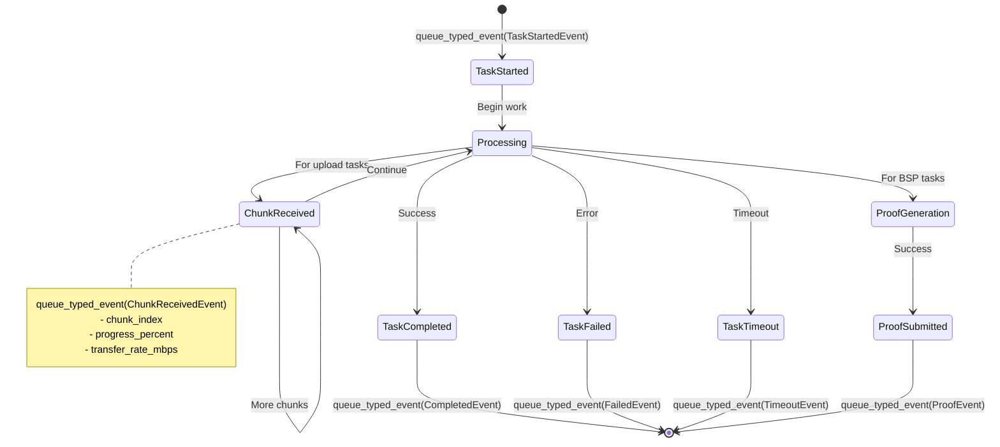
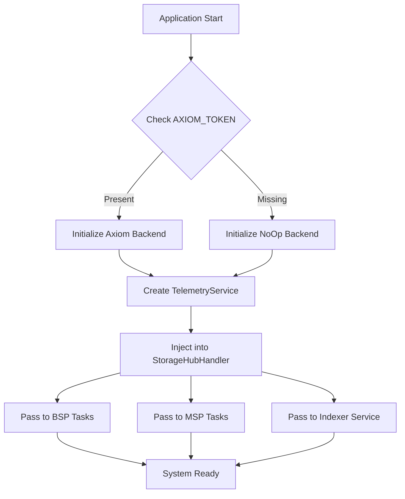

# StorageHub Telemetry Service

An actor-based telemetry service for the StorageHub client that provides production-ready observability with fully queryable, typed fields for all storage operations. The telemetry system uses a **fire-and-forget pattern** that ensures telemetry never blocks the main application flow.

## Table of Contents

- [Architecture Overview](#architecture-overview)
- [Core Components](#core-components)
- [Data Flow](#data-flow)
- [Integration Points](#integration-points)
- [Event Types](#event-types)
- [Implementation Patterns](#implementation-patterns)
- [Configuration](#configuration)
- [Query Examples](#query-examples)
- [Development Guide](#development-guide)

## Architecture Overview

### Actor-Based Service Pattern

The telemetry system is built as a standalone actor service that follows the established actor framework pattern in StorageHub. This provides:

- **Complete Isolation**: Telemetry runs in its own actor with separate task spawning
- **Fire-and-Forget Messaging**: Tasks send events without waiting for confirmation
- **Graceful Degradation**: If telemetry fails, the main application continues unaffected
- **Consistent Patterns**: Uses the same actor framework as other StorageHub services

### Key Architectural Principles

1. **Pure Fire-and-Forget**: Only supports async event queuing - no synchronous operations
2. **Zero Blocking**: Main application never waits for telemetry operations
3. **Type Safety**: All events use typed fields - NO JSON blobs for metrics
4. **Production Ready**: Batching, buffering, retry logic, overflow handling
5. **Backend Abstraction**: Supports multiple backends (Axiom, NoOp)
6. **Local Cohesion**: Events defined in task files where they're used

## Core Components

### 1. TelemetryService Actor

The main actor service with batching and bounded channels:

```rust
pub struct TelemetryService {
    service_name: String,
    node_id: Option<String>,
    backend: Arc<dyn TelemetryBackend>,
    config: TelemetryConfig,
    metrics: TelemetryMetrics,
    sender: mpsc::Sender<TelemetryEventWrapper>,
    // ... other fields
}
```

**Features:**
- **Bounded Channel**: Prevents resource exhaustion (10K event buffer)
- **Automatic Batching**: Network-efficient (100 events or 5-second flush)
- **Retry Logic**: Configurable retry strategies based on event importance
- **Graceful Shutdown**: Ensures all events are flushed on shutdown

### 2. Command Interface

Fire-and-forget command pattern for sending events:

```rust
pub enum TelemetryServiceCommand {
    QueueEvent { event: JsonValue, strategy: TelemetryStrategy },
}

#[async_trait]
pub trait TelemetryServiceCommandInterfaceExt {
    async fn queue_typed_event<T>(&self, event: T) -> Result<()>
    where T: TelemetryEvent + Send;
}
```

### 3. Backend Abstraction

Pluggable backend system:

```rust
#[async_trait]
pub trait TelemetryBackend: Send + Sync {
    async fn send_batch(&self, events: Vec<JsonValue>) -> Result<(), Box<dyn Error>>;
    fn is_enabled(&self) -> bool;
    async fn flush(&self) -> Result<(), Box<dyn Error>>;
    fn name(&self) -> &str;
}
```

**Implementations:**
- **AxiomBackend**: Sends events to Axiom time-series database
- **NoOpBackend**: Disabled telemetry (when not configured)

### 4. Event Type System

All events implement the `TelemetryEvent` trait:

```rust
pub trait TelemetryEvent: Serialize + Send + Sync {
    fn event_type(&self) -> &str;
    fn strategy(&self) -> TelemetryStrategy;
    fn to_json(&self) -> serde_json::Value;
}

#[derive(Debug, Clone, Serialize, Deserialize)]
pub struct BaseTelemetryEvent {
    pub timestamp: DateTime<Utc>,
    pub service: String,
    pub event_type: String,
    pub node_id: Option<String>,
    pub correlation_id: Option<String>,
    // ... other common fields
}
```

## Data Flow

### System Integration Flow

```mermaid
graph TB
    subgraph "Node Startup"
        START[Node Starts] --> SPAWN[Spawn TelemetryService Actor]
        SPAWN --> CONFIG{Axiom Configured?}
        CONFIG -->|Yes| AXIOM[Create AxiomBackend]
        CONFIG -->|No| NOOP[Create NoOpBackend]
        AXIOM --> READY[Service Ready]
        NOOP --> READY
    end
    
    subgraph "StorageHub Integration"
        READY --> BUILDER[StorageHubBuilder.with_telemetry()]
        BUILDER --> HANDLER[StorageHubHandler.telemetry]
        HANDLER --> TASKS[Pass to Tasks]
        HANDLER --> INDEXER[Pass to Indexer Service]
    end
    
    subgraph "Event Flow"
        TASKS --> EVENTS[Tasks Create Local Events]
        INDEXER --> EVENTS
        EVENTS --> QUEUE[queue_typed_event()]
        QUEUE --> ACTOR[TelemetryService Actor]
        ACTOR --> WORKER[Background Worker]
        WORKER --> BATCH[Batch & Send to Backend]
    end
```

### Command Flow (Fire-and-Forget)

```mermaid
sequenceDiagram
    participant Task as Storage Task
    participant Handle as TelemetryService Handle
    participant Actor as TelemetryService Actor
    participant Worker as Background Worker
    participant Backend as Axiom Backend
    
    Task->>Handle: queue_typed_event(event)
    Note over Handle: Converts to JSON<br/>Returns immediately
    Handle-->>Task: Ok(()) - Fire & Forget
    
    Handle->>Actor: QueueEvent command (via mpsc)
    Actor->>Worker: Forward to worker channel
    
    Note over Task: Task continues execution<br/>without waiting
    
    Worker->>Worker: Add to batch buffer
    
    alt Buffer full (100 events) or Timer (5s)
        Worker->>Backend: send_batch(events)
        Backend-->>Worker: Ok/Error
        
        alt Retry needed
            Worker->>Worker: Apply retry strategy
            Worker->>Backend: Retry send
        end
    end
```

### Task Lifecycle Telemetry



## Integration Points

### 1. Node Startup Integration

In `node/src/service.rs`:

```rust
// Spawn telemetry service as an actor
let telemetry_task_spawner = TaskSpawner::new(task_manager.spawn_handle(), "telemetry-service");
if let Some(telemetry_handle) = shc_telemetry_service::spawn_telemetry_service(
    &telemetry_task_spawner,
    service_name,
    Some(node_id),
    axiom_token.clone(),
    axiom_dataset.clone(),
)
.await
{
    info!("Telemetry service initialized and configured");
    return Some(telemetry_handle);
}
```

### 2. StorageHubHandler Integration

```rust
pub struct StorageHubHandler {
    // ... other fields
    pub telemetry: Option<ActorHandle<TelemetryService>>,
}

// In StorageHubBuilder
pub fn with_telemetry(&mut self, telemetry: ActorHandle<TelemetryService>) -> &mut Self {
    self.telemetry = Some(telemetry);
    self
}
```

### 3. Task Integration Pattern

Each task follows this pattern for telemetry integration:

```rust
use shc_telemetry_service::{
    create_base_event, BaseTelemetryEvent, TelemetryEvent, 
    TelemetryServiceCommandInterfaceExt,
};
use shc_common::task_context::{TaskContext, classify_error};

// 1. Define local event types in the task file
#[derive(Debug, Clone, Serialize, Deserialize)]
struct BspUploadStartedEvent {
    #[serde(flatten)]
    base: BaseTelemetryEvent,
    task_id: String,
    file_key: String,
    file_size_bytes: u64,
    // ... other typed fields
}

impl TelemetryEvent for BspUploadStartedEvent {
    fn event_type(&self) -> &str {
        "bsp_upload_started"
    }
}

// 2. In event handler - fire and forget pattern
impl<NT, Runtime> EventHandler<NewStorageRequest> for BspUploadFileTask<NT, Runtime> {
    async fn handle_event(&mut self, event: NewStorageRequest) -> anyhow::Result<()> {
        // Create task context for tracking
        let ctx = TaskContext::new("bsp_upload_file");
        
        // Send start event (fire-and-forget)
        if let Some(telemetry_service) = &self.storage_hub_handler.telemetry {
            let start_event = BspUploadStartedEvent {
                base: create_base_event("bsp_upload_started", "storage-hub-bsp".to_string(), None),
                task_id: ctx.task_id.clone(),
                file_key: format!("{:?}", event.file_key),
                file_size_bytes: event.size as u64,
                // ... populate other fields
            };
            // Returns immediately - doesn't block task execution
            telemetry_service.queue_typed_event(start_event).await.ok();
        }
        
        // Continue with task logic...
        let result = self.process_storage_request(event).await;
        
        // Send completion/failure events
        if let Some(telemetry_service) = &self.storage_hub_handler.telemetry {
            match &result {
                Ok(_) => {
                    let complete_event = BspUploadCompletedEvent {
                        // ... completion details
                    };
                    telemetry_service.queue_typed_event(complete_event).await.ok();
                }
                Err(e) => {
                    let failed_event = BspUploadFailedEvent {
                        error_type: classify_error(&e),
                        error_message: e.to_string(),
                        // ... error details
                    };
                    telemetry_service.queue_typed_event(failed_event).await.ok();
                }
            }
        }
        
        result
    }
}
```

## Event Types

### Base Event Structure

All events include common fields through `BaseTelemetryEvent`:

```rust
#[derive(Debug, Clone, Serialize, Deserialize)]
pub struct BaseTelemetryEvent {
    pub timestamp: DateTime<Utc>,     // When the event occurred
    pub service: String,              // "storage-hub-bsp", "storage-hub-msp", etc.
    pub event_type: String,           // "bsp_upload_started", "msp_fees_charged", etc.
    pub node_id: Option<String>,      // Node identifier
    pub correlation_id: Option<String>, // For tracing related events
}
```

### BSP Event Examples

```rust
// File upload lifecycle
pub struct BspUploadStartedEvent {
    #[serde(flatten)]
    pub base: BaseTelemetryEvent,
    pub task_id: String,
    pub file_key: String,
    pub file_size_bytes: u64,
    pub location: String,
    pub fingerprint: String,
    pub peer_id: String,
}

pub struct BspUploadChunkReceivedEvent {
    #[serde(flatten)]
    pub base: BaseTelemetryEvent,
    pub task_id: String,
    pub file_key: String,
    pub chunk_index: u32,
    pub chunk_size_bytes: u64,
    pub total_chunks: u32,
    pub bytes_received: u64,
    pub bytes_total: u64,
}

pub struct BspUploadCompletedEvent {
    #[serde(flatten)]
    pub base: BaseTelemetryEvent,
    pub task_id: String,
    pub file_key: String,
    pub duration_ms: u64,
    pub avg_transfer_rate_mbps: f64,
    pub chunks_received: u32,
}
```

### MSP Event Examples

```rust
pub struct MspFeesChargedEvent {
    #[serde(flatten)]
    pub base: BaseTelemetryEvent,
    pub fee_amount: u128,
    pub currency: String,              // "DOT"
    pub bucket_count: u32,
    pub user_count: u32,
    pub total_storage_used_bytes: u64,
    pub successful_charges: u32,
    pub failed_charges: u32,
}
```

### Indexer Event Examples

```rust
pub struct IndexerBlockProcessedEvent {
    #[serde(flatten)]
    pub base: BaseTelemetryEvent,
    pub handler_name: String,          // "fishing" or "lite"
    pub block_number: u64,
    pub block_hash: String,
    pub events_count: u32,
    pub processing_time_ms: u64,
}
```

## Implementation Patterns

### 1. Fire-and-Forget Pattern

**Key Principle**: Telemetry never blocks the main application flow.

```rust
// ✅ Correct - Fire and forget
if let Some(telemetry) = &self.storage_hub_handler.telemetry {
    telemetry.queue_typed_event(event).await.ok(); // Returns immediately
}

// ❌ Wrong - Don't wait or handle errors
if let Some(telemetry) = &self.storage_hub_handler.telemetry {
    if let Err(e) = telemetry.queue_typed_event(event).await {
        // Don't do this - defeats the purpose of fire-and-forget
        error!("Telemetry failed: {}", e);
    }
}
```

### 2. Local Event Definitions

**Pattern**: Define events in the task file where they're used, not in a central location.

```rust
// In client/src/tasks/bsp_upload_file.rs

// Local event definitions for this specific task
#[derive(Debug, Clone, Serialize, Deserialize)]
struct BspUploadStartedEvent {
    #[serde(flatten)]
    base: BaseTelemetryEvent,
    // Task-specific fields
}

#[derive(Debug, Clone, Serialize, Deserialize)]
struct BspUploadFailedEvent {
    #[serde(flatten)]
    base: BaseTelemetryEvent,
    // Task-specific fields
}

impl TelemetryEvent for BspUploadStartedEvent {
    fn event_type(&self) -> &str {
        "bsp_upload_started"
    }
}

// Use in the same file
impl EventHandler<NewStorageRequest> for BspUploadFileTask {
    // Use the locally defined events
}
```

### 3. TaskContext Pattern

Use `TaskContext` for consistent task lifecycle tracking:

```rust
use shc_common::task_context::{TaskContext, classify_error};

let ctx = TaskContext::new("bsp_upload_file");

// TaskContext provides:
// - ctx.task_id: Unique task identifier
// - ctx.task_name: Task name for grouping
// - ctx.elapsed_ms(): Duration since task start
// - classify_error(): Error classification for telemetry
```

### 4. Error Classification

```rust
use shc_common::task_context::classify_error;

match result {
    Err(e) => {
        let error_type = classify_error(&e); // "network_error", "storage_error", etc.
        let failed_event = TaskFailedEvent {
            error_type,
            error_message: e.to_string(),
            // ...
        };
        telemetry.queue_typed_event(failed_event).await.ok();
    }
}
```

## Configuration

### Environment Variables

```bash
# REQUIRED: Axiom Configuration
AXIOM_TOKEN=xaat-your-token-here       # Axiom API token
AXIOM_DATASET=storage-hub-prod         # Dataset name in Axiom

# OPTIONAL: Telemetry Tuning (defaults shown)
TELEMETRY_BUFFER_SIZE=10000           # Max events in buffer
TELEMETRY_BATCH_SIZE=100              # Events per batch
TELEMETRY_FLUSH_INTERVAL=5            # Seconds between flushes
TELEMETRY_BACKEND_TIMEOUT=10          # Backend timeout seconds
TELEMETRY_MAX_RETRIES=3               # Retry attempts
```

### Telemetry Strategies

Events can specify delivery strategies:

```rust
impl TelemetryEvent for CriticalEvent {
    fn strategy(&self) -> TelemetryStrategy {
        TelemetryStrategy::Critical  // Will retry aggressively
    }
}

impl TelemetryEvent for BestEffortEvent {
    fn strategy(&self) -> TelemetryStrategy {
        TelemetryStrategy::BestEffort  // Default - drop on failure
    }
}
```

### Configuration Flow



## Query Examples

### Axiom Query Language (KQL)

#### Monitor Upload Performance

```kusto
// Find slow uploads
['storage-hub-prod']
| where event_type == "bsp_upload_completed"
| where duration_ms > 10000
| project timestamp, task_id, file_key, file_size_bytes, duration_ms, avg_transfer_rate_mbps
| order by duration_ms desc
| take 100
```

#### Track Real-time Upload Progress

```kusto
// Monitor ongoing upload for a specific file
['storage-hub-prod']
| where file_key == "0x123abc..."
| where event_type in ("bsp_upload_started", "bsp_upload_chunk_received", "bsp_upload_completed", "bsp_upload_failed")
| project timestamp, event_type, bytes_received, bytes_total, chunk_index
| order by timestamp asc
```

#### Error Analysis

```kusto
// Categorize errors by type
['storage-hub-prod']
| where event_type contains "failed"
| summarize 
    error_count = count(),
    unique_tasks = dcount(task_id)
    by error_type, bin(timestamp, 1h)
| order by error_count desc
```

#### Performance Metrics

```kusto
// Proof generation performance
['storage-hub-prod']
| where event_type == "bsp_proof_submitted"
| summarize 
    avg_generation_time = avg(generation_time_ms),
    p95_generation_time = percentile(generation_time_ms, 95),
    total_proofs = count()
    by bin(timestamp, 1h)
| render timechart
```

## Development Guide

### Adding New Events

1. **Define events locally** in the task file:
```rust
#[derive(Debug, Clone, Serialize, Deserialize)]
struct MyTaskStartedEvent {
    #[serde(flatten)]
    base: BaseTelemetryEvent,
    // Add typed fields - NO JSON blobs
    custom_field: String,
    numeric_metric: u64,
}

impl TelemetryEvent for MyTaskStartedEvent {
    fn event_type(&self) -> &str {
        "my_task_started"
    }
}
```

2. **Send events using fire-and-forget**:
```rust
if let Some(telemetry) = &self.storage_hub_handler.telemetry {
    let event = MyTaskStartedEvent {
        base: create_base_event("my_task_started", "my-service".to_string(), None),
        custom_field: "value".to_string(),
        numeric_metric: 42,
    };
    telemetry.queue_typed_event(event).await.ok();
}
```

### Testing Telemetry

```rust
#[cfg(test)]
mod tests {
    use super::*;

    #[test]
    fn test_event_serialization() {
        let event = MyTaskStartedEvent {
            base: create_base_event("test", "test-service".to_string(), None),
            custom_field: "test".to_string(),
            numeric_metric: 123,
        };
        
        let json = event.to_json();
        
        // Verify all fields are top-level and queryable
        assert!(json["custom_field"].is_string());
        assert!(json["numeric_metric"].is_u64());
        assert!(json["timestamp"].is_string());
        assert_eq!(json["event_type"], "my_task_started");
        
        // Ensure no nested JSON blobs
        assert!(json.as_object().unwrap().values().all(|v| !v.is_object() || v.get("base").is_some()));
    }
}
```

### Key Design Rules

1. **No JSON Blobs**: Every field must be a top-level, typed field
2. **Fire-and-Forget**: Never wait for telemetry operations
3. **Local Cohesion**: Define events where they're used
4. **Type Safety**: All events implement `TelemetryEvent` trait
5. **Non-blocking**: Telemetry failures don't affect main application

### Internal Health Monitoring

The telemetry service internally tracks metrics for operational health:

```rust
#[derive(Clone)]
pub struct TelemetryMetrics {
    pub events_sent: AtomicU64,
    pub events_dropped: AtomicU64,
    pub events_failed: AtomicU64,
    pub batches_sent: AtomicU64,
    pub backend_errors: AtomicU64,
}
```

These metrics are used internally for logging and debugging but are not exposed through the public API to maintain the pure fire-and-forget architecture.

## Summary

The StorageHub telemetry service provides:

1. **Pure Fire-and-Forget Architecture**: Only supports async event queuing - no synchronous operations
2. **Actor Service Architecture**: Runs as independent actor, never blocks main app
3. **Local Event Definitions**: Events defined where they're used for better cohesion
4. **Full Queryability**: Every field is typed and queryable - NO JSON blobs
5. **Production Ready**: Batching, buffering, retry logic, graceful shutdown
6. **Zero Impact**: Telemetry failures don't affect main application
7. **Type Safety**: Compile-time validation through `TelemetryEvent` trait

This architecture ensures comprehensive observability without impacting system performance or reliability while maintaining a clean, simple API that prevents any blocking operations.