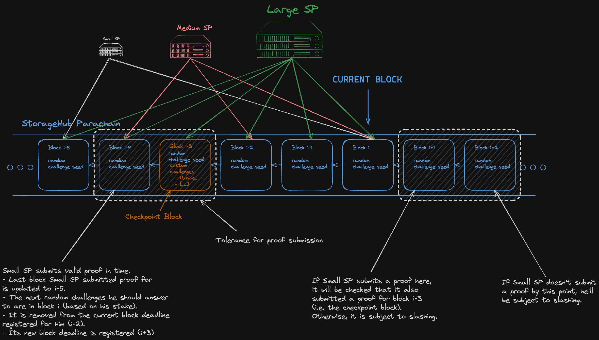
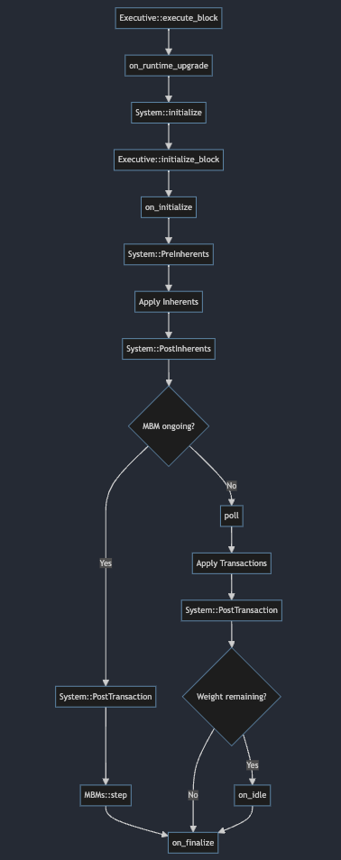
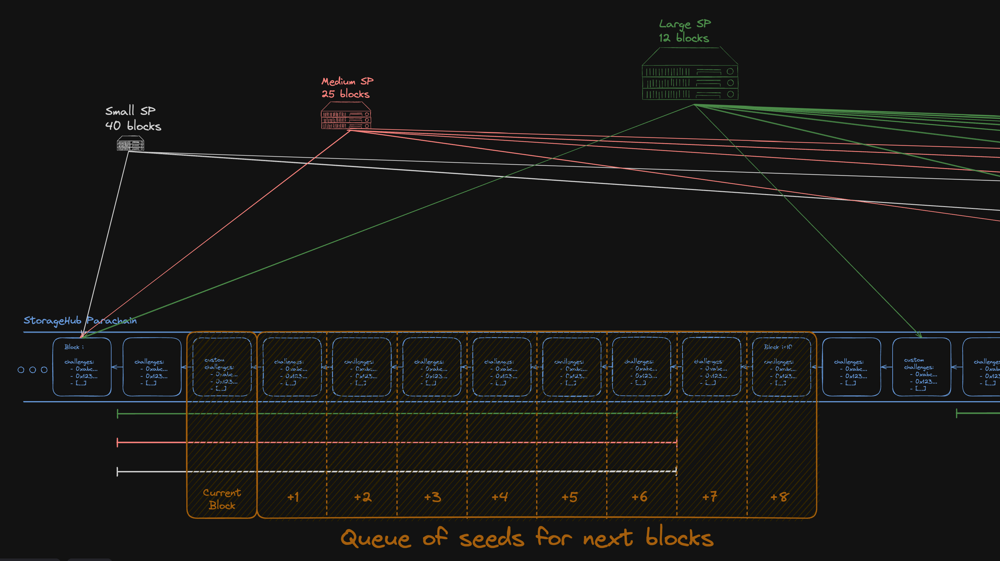
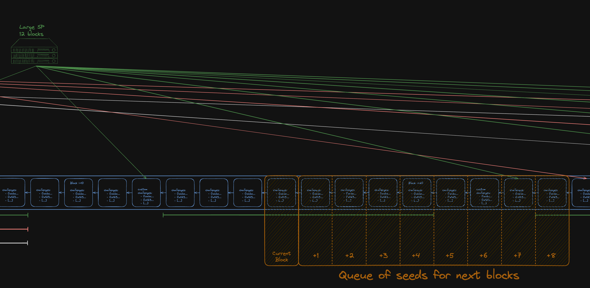

# Proofs Dealer Pallet

## Overview

The Proofs Dealer pallet is designed as a very agnostic, unopinionated, highly configurable pallet for sending out challenges to Providers, verifying proof submissions and enforcing punishment for Providers who fail to respond to challenges.

This pallet introduces the concept of "Merkle Patricia Forests", which are none other than Merkle Patricia tries, whose leaves are themselves commitments. These commitment leaves, can also take the form of a Merkle Patricia trie roots for example, hence the name Merkle Patricia "Forest". Each leaf in the Merkle Patricia Forest is considered a commitment to providing service for something. That can be, for example, a file that a Provider committed to storing (in this scenario, Providers would be _Storage Providers_). But this pallet is abstracted over that, and the service that Providers are offering can be anything, as long as they can generate a cryptographic commitment to it. A "Provider" can be any entity that is identified by a Merkle Patricia Forest root. Such root is not stored by this pallet, but rather by another hypothetical "Providers" pallet, which must implement the [`ProvidersInterface`](../../primitives/traits/src/lib.rs) trait.

Once a Provider is registered and correctly initialised (a process which likely involves other pallets), this pallet will manage sending out random challenges to all Providers in an efficient manner, verifying the proofs they respond with, and marking them as "slashable" if they fail to respond to challenges. For proof verification, the Proofs Dealer pallet relies on the `ForestVerifier` and `KeyVerifier` configurable inner types, which have to implement the [`CommitmentVerifier`](../../primitives/traits/src/lib.rs) trait for proof verification. In other words, this pallet is abstracted over the cryptographic primitives used to verify proofs, it simply stores commitments, generates challenges, and manages responses to those challenges, but delegates the actual proof verification to the configurable inner types.

### Target Audience

This pallet is intended for blockchain developers interested in a complex and optimised challenge distribution algorithm for their Substrate-based blockchain. It provides the tools, data structures and extrinsics needed for such purpose. Although developed for the StorageHub codebase, it is highly abstracted and configurable, making it suitable for other use cases as well.

## Design



### Ticks vs Blocks

One important distinction that needs to be made is that the challenges are distributed in "ticks". Ticks are like blocks, except that the tick counter is skipped during Multi Block Migrations. A `ChallengesTicker` counter is incremented on every block, when the `on_poll` hook is called. `on_poll` is always called at the beginning of every block, except during Multi Block Migrations, and the challenges ticker is always incremented by 1. Therefore if there are no Multi Block Migrations, the challenges ticker will always be equal to the block number.

The reason for this distinction can be found in the [PR](https://github.com/paritytech/polkadot-sdk/pull/1781) that introduced the poll hook. During Multi Block Migrations, `on_poll` is not called, therefore the challenges ticker wouldn't be incremented. That is a desirable behaviour, since during Multi Block Migrations, Providers wouldn't have the opportunity to submit proofs. By not incrementing the challenges ticker, we ensure that no Provider is slashed during Multi Block Migrations.



### Random Challenge Distribution and Enforcement

A random seed is generated and stored at every tick. Each Provider has a "challenge period" of a number of ticks, that determines which ticks it has to look for, to know the challenges it would have to respond to. In the image above, we can see 3 Providers of different sizes, which therefore have different challenge periods. The challenge period is calculated as `stake / StakeToChallengePeriod`, where `StakeToChallengePeriod` is a configurable constant. In the example, the challenge period for the smallest Provider is 5 ticks, having to answer to challenges in blocks `i-5` and `i`. In a real world scenario, periods would be much longer, but for the sake of the diagram, it is kept short.

A Provider has a number of ticks as tolerance to respond to challenges. This tolerance is configured by the `ChallengesTicksTolerance` constant, and is common to all Providers, regardless of their size. In the example diagram, the tolerance is set to 2 ticks, so our small Provider would have submitted a proof for challenges in blocks `i-5`, either in block `i-3` or `i-4`.

In the image, it can also be observed that the current block is `i`, which contains the new challenge seed that our small Provider has to use to generate the challenges it is supposed to respond to. The seed is stored in the `TickToChallengesSeed` storage map, which is accessed with a tick number as key. The `TickToChallengesSeed` stores a `ChallengeHistoryLength` number of seeds, and the oldest seed is removed at every tick, before adding the new seed. With the seed, the Provider will generate a number of challenges set by the `RandomChallengesPerBlock` constant, which are made of the concatenation of the seed, the Provider's ID and an index, all SCALE-encoded, and later hashed. This is done in the following way:

```rust
for i in 0..RandomChallengesPerBlock {
    let challenge = T::MerkleTrieHashing::hash(
        &[
            seed.encode().as_ref(),
            provider_id.encode().as_ref(),
            i.encode().as_ref(),
        ]
        .concat(),
    );
}
```

At the end of the tolerance period, if the Provider has not submitted a proof for the challenges it is supposed to respond to, it is marked as "slashable". How that slashing is implemented is out of scope for this pallet.

The process of challenge seed generation and enforcement of proof submissions is implemented in the `do_new_challenges_round`, which is called by the `on_poll` hook at the beginning of every block, except during Multi Block Migrations.

#### Priority and Custom Challenges

Besides the regular random challenges, this pallet also supports priority challenges and custom challenges. Both kinds of challenges are ones where instead of challenges derived from a random seed, the Provider is challenged directly for a specific key that is the challenged key. They can serve different purposes, and it must be noted that challenging with priority is only possible by other pallets, through the `ProofsDealerInterface::challenge_with_priority` function, whereas custom challenges can be added both by other pallets and by users calling the `challenge` extrinsic. Users calling the `challenge` extrinsic are required to pay a fee of `ChallengesFee` tokens, which is a configurable constant. Registered Providers are exempt from this fee though.

As the name suggests, priority challenges are prioritised, and are always sent out first. Custom and Priority challenges are also sent out in the `on_poll` hook, with a period of `CheckpointChallengePeriod` ticks, which is a configurable constant. In the diagram above, `i-3` is a checkpoint challenge block, which means that besides the regular random challenges, it is also the block where the priority abd/or custom challenges are sent out. The logic for sending out priority and custom challenges is as follows:

1. Check the last checkpoint challenge tick by querying the `LastCheckpointTick` storage item.
2. Add `CheckpointChallengePeriod` to the last checkpoint challenge tick, and check if this is such tick.
3. If it is, create an entry in the `TickToCheckpointChallenges` storage map, with the current tick as key and an empty vector as value.
4. Start adding challenges from the `PriorityChallengesQueue` until the queue is empty, or the limit of `MaxCustomChallengesPerBlock` is reached.
5. If there is space left, add regular custom challenges from the `ChallengesQueue` until the queue is empty, or the limit of `MaxCustomChallengesPerBlock` is reached.

Checkpoint challenges have to be answered by ALL Providers, regardless of their size and period. This is enforced by the `submit_proof` extrinsic, which checks if there has been a checkpoint challenge tick in between tha last tick a Provider submitted a proof for and the tick for which the proof is being submitted. For example, in the image, the small Provider will have to respond to the random challenges in block `i`, either in block `i+1` or `i+2`. When it does that, this pallet will see that in between block `i-5` (last tick that this Provider submitted a proof for) and block `i` (tick for which the Provider is submitting a proof) there has been a checkpoint challenge in block `i-3`. Therefore, `submit_proof` will require that the proof submitted responds to both the random challenges in `i`, and the checkpoint challenges in `i-3`.

Checkpoint challenges can include "mutations", which are modifications to the Merkle Patricia Forest. Currently, the only mutation that is supported is the removal of a leaf from the Merkle Patricia Forest, when a checkpoint challenge is answered with a proof of inclusion, i.e. a proof that a challenged key is in the Merkle Patricia Forest of the Provider.

The logic for sending out priority and custom challenges is implemented in the `do_new_checkpoint_challenge_round`, which is called by `do_new_challenges_round` when the current tick is a checkpoint challenge tick.

### Randomness for Challenges




> TODO

### Proof Verification

There are two kinds of proofs that make up a "proof" for this pallet: forest proofs and key proofs. A forest proof proves that some keys belong to the Merkle Patricia Forest of a Provider. Key proofs are proofs of the service that the Provider provides. For example, in the case of Storage Providers, a forest proof proves that that Provider is supposed to store a certain file, and key proofs are the storage proofs themselves for that file.

Proofs can use any cryptographic primitive that allows for a Provider to commit to something (like a Merkle root), and later prove that it knows a certain value (like a leaf in a Merkle tree).

Proof verification, which happens in the `submit_proof` extrinsic, follows the next steps:

1. Check that the submitter is a registered Provider. A registered Provider is anything that can be identified by a Merkle Patricia Forest root, which is stored in the `Providers` pallet.
2. Get the Forest root for the submitter.
3. Get the last tick for which the submitter submitted a proof.
4. With the stake of the submitter, compute the challenges period, which is `stake / StakeToChallengePeriod`.
5. Compute the next tick for which the submitter should be submitting a proof. It should be a tick in the past, whose seed is stored in the `TickToChallengesSeed` storage map.
6. Get the seed for the challenges tick.
7. Generate the challenges from the seed, which are the concatenation of the seed, the Provider's ID and an index, all SCALE-encoded, and later hashed.
8. Check if there has been a checkpoint challenge tick in between the last tick proven by the submitter and the tick for which the proof is being submitted.
9. If there has been, the checkpoint challenges are added to the vector of challenges that the submitted proof is expected to respond to.
10. Verify the forest proof. This employs the `ForestVerifier`, passing it the root of the Provider, the challenges the proof is supposed to respond to, and the submitted proof itself. The `ForestVerifier` responds with the actual set of existing leaves in the Merkle Patricia Forest that were correctly proven. This is because in most cases, a Provider will not have the exact challenged key in its Merkle Patricia Forest, but will have to provide a unique answer to a challenge anyway, with the leaves that it has. The criteria for such uniqueness is left to the implementer of the `ForestVerifier`.
11. Apply the mutations (if any) to the Merkle Patricia Forest.
12. Verify the key proofs for the leaves that were proven in the forest proof.
13. If all checks pass, the proof is considered valid, and:
    1. The last tick for which the submitter submitted a proof is updated to the tick for which the proof is being submitted.
    2. The deadline for submitting a proof is updated to the next tick for which the submitter should be submitting a proof.

## Interfaces

This pallet implements:

- [`ProofsDealerInterface`](../../primitives/traits/src/lib.rs)

Depends on some other pallet implementing:

- [`ProvidersInterface`](../../primitives/traits/src/lib.rs)
- [`Randomness`](https://github.com/paritytech/polkadot-sdk/blob/929a273ae1ba647628c4ba6e2f8737e58b596d6a/substrate/frame/support/src/traits/randomness.rs#L26)

And `struct`s implementing:

- `ForestVerifier`:
  - [`CommitmentVerifier`](../../primitives/traits/src/lib.rs)
  - [`TrieProofDeltaApplier`](../../primitives/traits/src/lib.rs)
- `KeyVerifier`:
  - [`CommitmentVerifier`](../../primitives/traits/src/lib.rs)

These are further explained in their own documentation.
