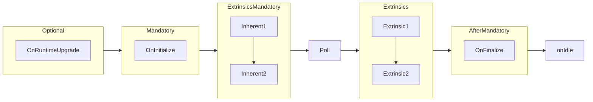

# Proofs Dealer Pallet

## Overview

The Proofs Dealer pallet is designed for as a very agnostic, unopinionated, highly configurable pallet for sending out challenges to Providers, verifying proof submissions and enforcing punishment for Providers who fail to respond to challenges.

This pallet introduces the concept of "Merkle Patricia Forests", which are none other than Merkle Patricia tries, whose leaves are themselves commitments. These commitment leaves, can also take the form of a Merkle Patricia trie roots for example, hence the name Merkle Patricia "Forest". Each leaf in the Merkle Patricia Forest is considered a commitment to providing service for something. That can be, for example, a file that a Provider committed to storing (in this scenario, Providers would be _Storage Providers_). But this pallet is abstracted over that, and the service that Providers are offering can be anything, as long as they can generate a cryptographic commitment to it. A "Provider" can be any entity that is identified by a Merkle Patricia Forest root. Such root is not stored by this pallet, but rather by another hypothetical "Providers" pallet, which must implement the [`ProvidersInterface`](../../primitives/traits/src/lib.rs) trait.

Once a Provider is registered and correctly initialised (a process which likely involves other pallets), this pallet will manage sending out random challenges to all Providers in an efficient manner, verifying the proofs they respond with, and marking them as "slashable" if they fail to respond to challenges. For proof verification, the Proofs Dealer pallet relies on the `ForestVerifier` and `KeyVerifier` configurable inner types, which have to implement the [`CommitmentVerifier`](../../primitives/traits/src/lib.rs) trait for proof verification. In other words, this pallet is abstracted over the cryptographic primitives used to verify proofs, it simply stores commitments, generates challenges, and manages responses to those challenges, but delegates the actual proof verification to the configurable inner types.

### Target Audience

This pallet is intended for blockchain developers interested in a complex and optimised challenge distribution algorithm for their Substrate-based blockchain. It provides the tools, data structures and extrinsics needed for such purpose. Although developed for the StorageHub codebase, it is highly abstracted and configurable, making it suitable for other use cases as well.

## Design

### Ticks vs Blocks

One important distinction that needs to be made is that the challenges are distributed in "ticks". Ticks are like blocks, except that the tick counter is skipped during Multi Block Migrations. A `ChallengesTicker` counter is incremented on every block, when the `on_poll` hook is called. `on_poll` is always called at the beginning of every block, except during Multi Block Migrations, and the challenges ticker is always incremented by 1. Therefore if there are no Multi Block Migrations, the challenges ticker will always be equal to the block number.

The reason for this distinction can be found in the [PR](https://github.com/paritytech/polkadot-sdk/pull/1781) that introduced the poll hook. During Multi Block Migrations, `on_poll` is not called, therefore the challenges ticker wouldn't be incremented. That is a desirable behaviour, since during Multi Block Migrations, Providers wouldn't have the opportunity to submit proofs. By not incrementing the challenges ticker, we ensure that no Provider is slashed during Multi Block Migrations.

### Random Challenge Distribution and Enforcement

#### Priority and Custom Challenges

### Randomness for Challenges

### Proof Verification

## Extrinsics

### challenge

### submit_proof

## Hooks

## on_poll

## integrity_test

## Interfaces

This pallet implements:

- [`ProofsDealerInterface`](../../primitives/traits/src/lib.rs)

Depends on some other pallet implementing:

- [`ProvidersInterface`](../../primitives/traits/src/lib.rs)

And `struct`s implementing:

- `ForestVerifier`:
  - [`CommitmentVerifier`](../../primitives/traits/src/lib.rs)
  - [`TrieProofDeltaApplier`](../../primitives/traits/src/lib.rs)
- `KeyVerifier`:
  - [`CommitmentVerifier`](../../primitives/traits/src/lib.rs)

These are further explained in their own documentation.
