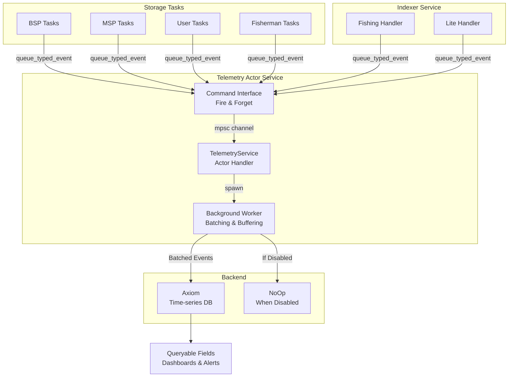
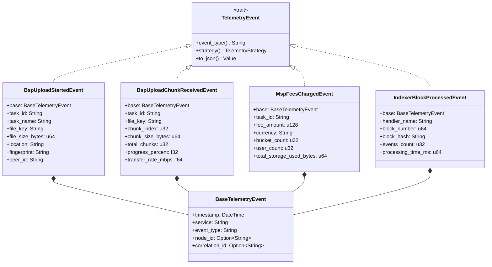
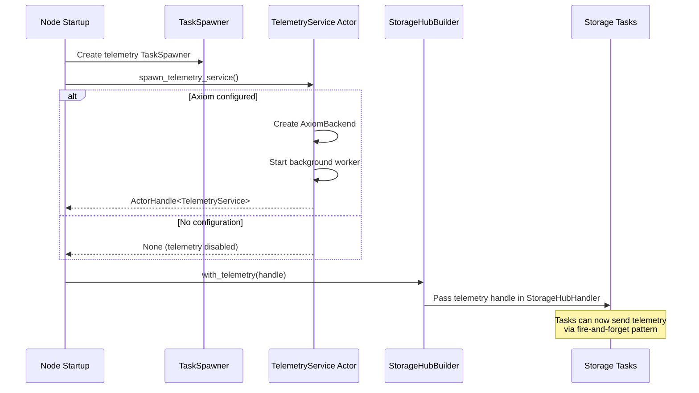
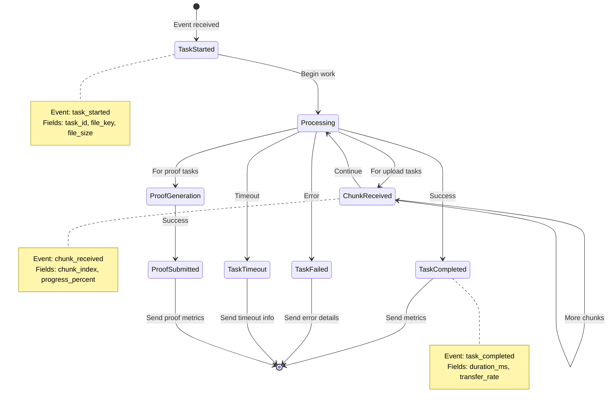
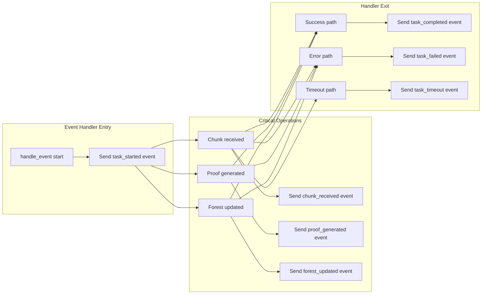
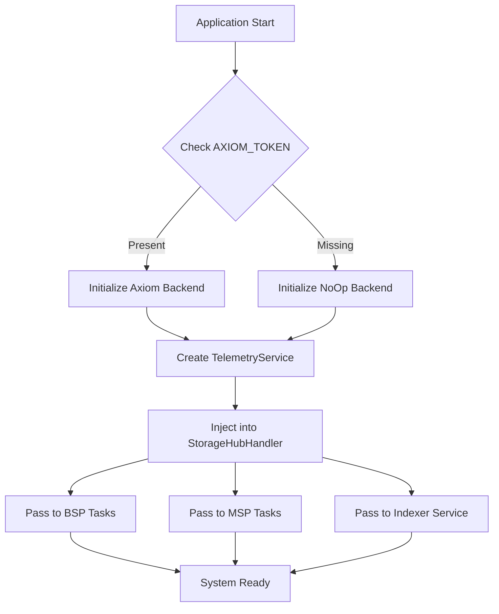

# StorageHub Telemetry Integration Plan

## Overview
This document provides a comprehensive plan for integrating telemetry throughout the StorageHub client system. The telemetry system provides production-ready observability with fully queryable, typed fields for all storage operations using an **actor-based service architecture** that ensures telemetry never blocks the main application flow.

## Core Architecture

### Actor-Based Service Pattern
The telemetry system is built as a standalone actor service (`telemetry-service` crate) that follows the established actor framework pattern in StorageHub. This provides:
- **Complete isolation**: Telemetry runs in its own actor with separate task spawning
- **Fire-and-forget messaging**: Tasks send events without waiting for confirmation
- **Graceful degradation**: If telemetry fails, the main application continues unaffected
- **Consistent patterns**: Uses the same actor framework as other StorageHub services

### Data Flow Overview



### Event Type Hierarchy



## Implementation Architecture

### Actor Service Initialization



### Component Integration Flow

```mermaid
sequenceDiagram
    participant Task as Storage Task
    participant TC as TaskContext
    participant Event as Local Event Definition
    participant TS as TelemetryService Handle
    participant Actor as TelemetryService Actor
    participant Worker as Background Worker
    participant Axiom as Axiom Backend
    
    Task->>TC: Create TaskContext
    TC-->>Task: task_id, start_time
    
    Task->>Event: Create local typed event
    Note over Event: BspUploadStartedEvent {<br/>  base: BaseTelemetryEvent,<br/>  task_id: "uuid",<br/>  file_key: "0x123",<br/>  file_size_bytes: 1024000,<br/>  ...<br/>}
    
    Task->>TS: queue_typed_event(event)
    Note over TS: Fire and forget -<br/>returns immediately
    TS->>Actor: QueueEvent command via mpsc
    TS-->>Task: Ok(()) - immediate return
    
    Note over Task: Task continues without<br/>waiting for telemetry
    
    Actor->>Worker: Forward to worker channel
    
    alt Buffer not full
        Worker->>Worker: Add to batch
    else Buffer full (overflow strategy)
        Worker->>Worker: Drop event & increment counter
    end
    
    loop Every 5 seconds or 100 events
        Worker->>Worker: Collect batch
        Worker->>Axiom: Send batch with timeout
        
        alt Success
            Axiom-->>Worker: Ok
            Worker->>Worker: Clear batch
        else Failure
            Axiom-->>Worker: Error
            Worker->>Worker: Retry based on TelemetryStrategy
        end
    end
```

### Task Lifecycle Telemetry



## Event Type Definitions

### Key Principle: Queryable Fields Only
**Every field must be a top-level, typed field. No JSON blobs for metrics.**

### BSP Event Types

#### File Upload Events
```rust
// Event sent when BSP starts receiving a file
pub struct BspUploadStartedEvent {
    #[serde(flatten)]
    pub base: BaseTelemetryEvent,      // Common fields
    
    // Task identification
    pub task_id: String,                // Unique task instance ID
    pub task_name: String,              // "bsp_upload_file"
    
    // File metadata (all queryable)
    pub file_key: String,               // Hex-encoded file key
    pub file_size_bytes: u64,          // Total file size
    pub location: String,               // Storage location
    pub fingerprint: String,            // File fingerprint
    pub peer_id: String,                // Peer sending the file
}

// Event sent for each chunk received
pub struct BspUploadChunkReceivedEvent {
    #[serde(flatten)]
    pub base: BaseTelemetryEvent,
    
    pub task_id: String,                // Links to BspUploadStartedEvent
    pub file_key: String,               
    pub chunk_index: u32,               // Current chunk number
    pub chunk_size_bytes: u64,          // Size of this chunk
    pub total_chunks: u32,              // Total expected chunks
    pub chunks_received: u32,           // Chunks received so far
    pub progress_percent: f32,          // Upload progress (0-100)
    pub transfer_rate_mbps: f64,        // Current transfer rate
}

// Event sent when upload completes successfully
pub struct BspUploadCompletedEvent {
    #[serde(flatten)]
    pub base: BaseTelemetryEvent,
    
    pub task_id: String,
    pub task_name: String,
    pub file_key: String,
    pub file_size_bytes: u64,
    pub duration_ms: u64,               // Total upload time
    pub average_transfer_rate_mbps: f64,
    pub proof_generation_time_ms: u64,  // Time to generate proof
    pub forest_root: String,            // New forest root
    pub merkle_root: String,            // File merkle root
}
```

#### Proof Submission Events
```rust
pub struct BspProofGenerationStartedEvent {
    #[serde(flatten)]
    pub base: BaseTelemetryEvent,
    
    pub task_id: String,
    pub proof_type: String,             // "storage" or "challenge"
    pub challenges_count: u32,          // Number of challenges
    pub forest_root: String,            // Current forest root
}

pub struct BspProofSubmittedEvent {
    #[serde(flatten)]
    pub base: BaseTelemetryEvent,
    
    pub task_id: String,
    pub proof_type: String,
    pub challenges_answered: u32,       // Challenges successfully answered
    pub merkle_root: String,            
    pub forest_root: String,
    pub generation_time_ms: u64,        // Proof generation time
    pub submission_attempts: u32,       // Number of submission attempts
    pub extrinsic_hash: String,        // Blockchain transaction hash
}
```

### MSP Event Types

#### Storage Management Events
```rust
pub struct MspUploadAcceptedEvent {
    #[serde(flatten)]
    pub base: BaseTelemetryEvent,
    
    pub task_id: String,
    pub file_key: String,
    pub bucket_id: String,              // Bucket storing the file
    pub file_size_bytes: u64,
    pub capacity_used_bytes: u64,       // Current capacity used
    pub capacity_available_bytes: u64,  // Remaining capacity
    pub auto_capacity_increased: bool,  // Was capacity auto-increased?
    pub capacity_increase_amount: Option<u64>,
}

pub struct MspFeesChargedEvent {
    #[serde(flatten)]
    pub base: BaseTelemetryEvent,
    
    pub task_id: String,
    pub fee_amount: u128,               // Amount charged
    pub currency: String,               // "DOT"
    pub bucket_count: u32,              // Number of buckets
    pub user_count: u32,                // Number of users charged
    pub total_storage_used_bytes: u64,  // Total storage being charged for
    pub billing_period: String,         // "monthly", "weekly", etc.
    pub successful_charges: u32,        // Successful fee collections
    pub failed_charges: u32,            // Failed fee collections
}
```

### Indexer Event Types

```rust
pub struct IndexerBlockProcessedEvent {
    #[serde(flatten)]
    pub base: BaseTelemetryEvent,
    
    pub handler_name: String,           // "fishing" or "lite"
    pub block_number: u64,
    pub block_hash: String,
    pub parent_hash: String,
    pub events_count: u32,              // Events in this block
    pub processing_time_ms: u64,
    pub indexing_mode: String,          // Current indexing mode
}

pub struct IndexerEventProcessedEvent {
    #[serde(flatten)]
    pub base: BaseTelemetryEvent,
    
    pub handler_name: String,
    pub block_number: u64,
    pub event_name: String,             // "FileSystem.NewStorageRequest"
    pub event_index: u32,               // Index within block
    pub processing_time_ms: u64,
    
    // Event-specific fields (all Optional, filled based on event type)
    pub file_key: Option<String>,
    pub bucket_id: Option<String>,
    pub provider_id: Option<String>,
    pub user_id: Option<String>,
}
```

## Integration Points

### Where to Add Telemetry



### Implementation Pattern

```rust
// PATTERN 1: Define Local Event Types in Task File
// Each task defines its own telemetry events locally for better cohesion

use shc_telemetry_service::{
    create_base_event, BaseTelemetryEvent, TelemetryEvent, TelemetryServiceCommandInterfaceExt,
};
use serde::{Deserialize, Serialize};

// Local event definitions for this task
#[derive(Debug, Clone, Serialize, Deserialize)]
struct BspUploadStartedEvent {
    #[serde(flatten)]
    base: BaseTelemetryEvent,
    task_id: String,
    task_name: String,
    file_key: String,
    file_size_bytes: u64,
    location: String,
    fingerprint: String,
    peer_id: String,
}

impl TelemetryEvent for BspUploadStartedEvent {
    fn event_type(&self) -> &str {
        "bsp_upload_started"
    }
}

// PATTERN 2: Task Event Handler with Fire-and-Forget Telemetry
impl<NT, Runtime> EventHandler<NewStorageRequest> for BspUploadFileTask<NT, Runtime> {
    async fn handle_event(&mut self, event: NewStorageRequest) -> anyhow::Result<()> {
        // 1. Create task context for tracking
        let ctx = TaskContext::new("bsp_upload_file");
        
        // 2. Send task started event (fire-and-forget)
        if let Some(telemetry_service) = &self.storage_hub_handler.telemetry {
            let start_event = BspUploadStartedEvent {
                base: create_base_event(
                    "bsp_upload_started", 
                    "storage-hub-bsp".to_string(), 
                    None
                ),
                task_id: ctx.task_id.clone(),
                task_name: ctx.task_name.clone(),
                file_key: format!("{:?}", event.file_key),
                file_size_bytes: event.size as u64,
                location: hex::encode(event.location.as_slice()),
                fingerprint: format!("{:?}", event.fingerprint),
                peer_id: format!("{:?}", event.user_peer_ids),
            };
            // Fire and forget - returns immediately
            telemetry_service.queue_typed_event(start_event).await.ok();
        }
        
        // 3. Execute task (telemetry doesn't block)
        let result = self.process_storage_request(event.clone()).await;
        
        // 4. Send completion or failure event
        if let Some(telemetry_service) = &self.storage_hub_handler.telemetry {
            match &result {
                Ok(data) => {
                    let complete_event = BspUploadCompletedEvent {
                        base: create_base_event(
                            "bsp_upload_completed",
                            "storage-hub-bsp".to_string(),
                            None
                        ),
                        task_id: ctx.task_id,
                        file_key: format!("{:?}", event.file_key),
                        file_size_bytes: event.size as u64,
                        duration_ms: ctx.elapsed_ms(),
                        average_transfer_rate_mbps: data.transfer_rate,
                        // ... other fields
                    };
                    telemetry_service.queue_typed_event(complete_event).await.ok();
                }
                Err(e) => {
                    let failed_event = BspUploadFailedEvent {
                        base: create_base_event(
                            "bsp_upload_failed",
                            "storage-hub-bsp".to_string(),
                            None
                        ),
                        task_id: ctx.task_id,
                        file_key: format!("{:?}", event.file_key),
                        error_type: classify_error(&e),
                        error_message: e.to_string(),
                        duration_ms: Some(ctx.elapsed_ms()),
                        // ... other fields
                    };
                    telemetry_service.queue_typed_event(failed_event).await.ok();
                }
            }
        }
        
        result
    }
}
```

## Query Examples

### Axiom Query Language (KQL)

#### Find Slow Uploads
```kusto
// Find uploads taking longer than 10 seconds
['storage-hub-prod']
| where event_type == "bsp_upload_completed"
| where duration_ms > 10000
| project task_id, file_key, file_size_bytes, duration_ms, average_transfer_rate_mbps
| order by duration_ms desc
| take 100
```

#### Track Upload Progress Real-time
```kusto
// Monitor ongoing upload progress for a specific file
['storage-hub-prod']
| where file_key == "0x123abc..."
| where event_type in ("bsp_upload_started", "bsp_upload_chunk_received", "bsp_upload_completed", "bsp_upload_failed")
| project timestamp, event_type, progress_percent, chunks_received, total_chunks, transfer_rate_mbps
| order by timestamp asc
```

#### Proof Generation Performance
```kusto
// Analyze proof generation performance over time
['storage-hub-prod']
| where event_type == "bsp_proof_submitted"
| summarize 
    avg_generation_time = avg(generation_time_ms),
    p95_generation_time = percentile(generation_time_ms, 95),
    p99_generation_time = percentile(generation_time_ms, 99),
    total_proofs = count(),
    failed_attempts = sum(submission_attempts - 1)
    by bin(timestamp, 1h), proof_type
| render timechart
```

#### Error Analysis
```kusto
// Categorize and count errors by type
['storage-hub-prod']
| where event_type contains "failed"
| summarize 
    error_count = count(),
    unique_tasks = dcount(task_id),
    avg_retry_count = avg(retry_count)
    by error_type, task_name, bin(timestamp, 1h)
| order by error_count desc
```

#### MSP Capacity Monitoring
```kusto
// Monitor MSP capacity utilization
['storage-hub-prod']
| where event_type == "msp_upload_accepted"
| extend utilization_percent = (capacity_used_bytes * 100.0) / (capacity_used_bytes + capacity_available_bytes)
| project timestamp, bucket_id, utilization_percent, auto_capacity_increased
| where utilization_percent > 80
| order by utilization_percent desc
```

#### Fee Collection Metrics
```kusto
// Track fee collection success rate
['storage-hub-prod']
| where event_type == "msp_fees_charged"
| extend success_rate = (successful_charges * 100.0) / (successful_charges + failed_charges)
| summarize 
    total_fees = sum(fee_amount),
    avg_success_rate = avg(success_rate),
    total_users = sum(user_count)
    by billing_period, bin(timestamp, 1d)
| render columnchart
```

## Configuration

### Environment Variables

```bash
# REQUIRED: Axiom Configuration
AXIOM_TOKEN=xaat-your-token-here       # Axiom API token
AXIOM_DATASET=storage-hub-prod         # Dataset name in Axiom

# OPTIONAL: Telemetry Tuning
TELEMETRY_BUFFER_SIZE=10000           # Max events in buffer (default: 10000)
TELEMETRY_BATCH_SIZE=100              # Events per batch (default: 100)
TELEMETRY_FLUSH_INTERVAL=5            # Seconds between flushes (default: 5)
TELEMETRY_BACKEND_TIMEOUT=10          # Backend timeout seconds (default: 10)
TELEMETRY_MAX_RETRIES=3               # Retry attempts (default: 3)
```

### Initialization Flow



## Testing Strategy

### Unit Test Requirements
```rust
#[cfg(test)]
mod tests {
    // 1. Test event creation
    #[test]
    fn test_event_serialization() {
        let event = BspUploadStartedEvent { /* ... */ };
        let json = serde_json::to_value(&event).unwrap();
        
        // Verify all fields are top-level
        assert!(json["file_key"].is_string());
        assert!(json["file_size_bytes"].is_u64());
        // No nested objects for metrics
        assert!(json["custom_metrics"].is_null());
    }
    
    // 2. Test non-blocking behavior
    #[tokio::test]
    async fn test_telemetry_non_blocking() {
        let telemetry = create_test_telemetry();
        
        // Fill buffer
        for _ in 0..20000 {
            telemetry.send_event(test_event());
        }
        
        // Should not block, should drop events
        let start = Instant::now();
        telemetry.send_event(test_event());
        assert!(start.elapsed() < Duration::from_millis(1));
    }
}
```

## Success Criteria

### Technical Requirements
- ✅ All fields are queryable (no JSON blobs)
- ✅ Zero blocking on telemetry operations
- ✅ < 1% performance overhead
- ✅ 100% task coverage
- ✅ Graceful degradation when disabled

### Observable Metrics
- File transfer success/failure rates
- Average transfer speeds by provider
- Proof generation p50/p95/p99 times
- Storage capacity utilization trends
- Fee collection success rates
- Error rates by task and type
- Provider performance rankings

## Migration Checklist

### Phase 1: Foundation ✅ COMPLETED
- [x] **Create telemetry-service actor crate**
  - ✅ Created `client/telemetry-service/` with full actor implementation
  - ✅ Implemented `TelemetryService` actor with batching and buffering
  - ✅ Created fire-and-forget command interface (`TelemetryServiceCommand`)
  - ✅ Implemented `TelemetryServiceCommandInterfaceExt` for typed events
  - ✅ Added background worker with retry logic and overflow strategies
- [x] **Create backend abstraction**
  - ✅ Implemented `TelemetryBackend` trait
  - ✅ Created `AxiomBackend` implementation with HTTP client
  - ✅ Created `NoOpBackend` for when telemetry is disabled
  - ✅ Added configuration via environment variables
- [x] **Create event type definitions**
  - ✅ Created `telemetry-service/src/telemetry/events/` directory structure
  - ✅ Implemented `bsp_events.rs` with all BSP operations
  - ✅ Implemented `msp_events.rs` with all MSP operations
  - ✅ Implemented `user_events.rs` with user operations
  - ✅ Implemented `fisherman_events.rs` with verification events
  - ✅ Implemented `indexer_events.rs` with blockchain indexing events
  - ✅ **KEY ACHIEVEMENT**: All events use typed fields - NO JSON blobs!
- [x] **Integrate telemetry service into node**
  - ✅ Added telemetry service spawning in `node/src/service.rs`
  - ✅ Added `with_telemetry()` method to StorageHubBuilder
  - ✅ Updated StorageHubHandler to include telemetry handle
  - ✅ Telemetry runs as independent actor - never blocks main app
- [x] **Create TaskContext helper**
  - ✅ Created `client/common/src/task_context.rs`
  - ✅ Includes task_id generation, elapsed time tracking
  - ✅ Added helper functions: `classify_error()`, `calculate_transfer_rate_mbps()`

### Phase 2: BSP Upload Task ✅ COMPLETED
- [x] **Fully instrument BSP upload file task**
  - ✅ Task defines events locally in `bsp_upload_file.rs` for better cohesion
  - ✅ Instrumented `NewStorageRequest` handler with start/failed events
  - ✅ Instrumented `RemoteUploadRequest` handler with chunk events
  - ✅ Instrumented `ProcessConfirmStoringRequest` handler with proof events
  - ✅ All events use fire-and-forget pattern via `queue_typed_event()`
  - ✅ Complete lifecycle tracking: start → chunks → proof → complete/fail

### Phase 3: Complete Task Coverage 🚧 IN PROGRESS

#### Pattern to Follow for Each Task
Each task should follow the BSP upload pattern:
1. **Define events locally** in the task file (not in telemetry-service)
2. **Use TaskContext** to track task lifecycle
3. **Send events via fire-and-forget** using `queue_typed_event()`
4. **Include all typed fields** - no JSON blobs

#### BSP Tasks Remaining
- [ ] **`bsp_download_file.rs`**
  - [ ] Define: `BspDownloadRequestedEvent`, `BspDownloadChunkSentEvent`, `BspDownloadCompletedEvent`, `BspDownloadFailedEvent`
  - [ ] Track: download request → chunk sending → completion
- [ ] **`bsp_submit_proof.rs`**
  - [ ] Define: `BspProofChallengeReceivedEvent`, `BspProofGeneratedEvent`, `BspProofSubmittedEvent`, `BspProofAcceptedEvent`, `BspProofRejectedEvent`
  - [ ] Track: challenge receipt → proof generation → submission → result
- [ ] **`bsp_charge_fees.rs`**
  - [ ] Define: `BspFeeCalculationStartedEvent`, `BspFeeChargedEvent`, `BspFeeCollectionFailedEvent`
  - [ ] Track: fee calculation → charging → success/failure
- [ ] **`bsp_move_bucket.rs`**
  - [ ] Define: `BspBucketMoveStartedEvent`, `BspBucketMoveProgressEvent`, `BspBucketMoveCompletedEvent`, `BspBucketMoveFailedEvent`
  - [ ] Track: move initiation → progress → completion
- [ ] **`bsp_delete_file.rs`**
  - [ ] Define: `BspFileDeletionStartedEvent`, `BspFileDeletionCompletedEvent`, `BspFileDeletionFailedEvent`
  - [ ] Track: deletion request → execution → result

#### MSP Tasks Remaining
- [ ] **`msp_upload_file.rs`**
  - [ ] Define: `MspUploadAcceptedEvent`, `MspCapacityIncreasedEvent`, `MspUploadRejectedEvent`
  - [ ] Track: upload acceptance → capacity management → result
- [ ] **`msp_charge_fees.rs`**
  - [ ] Define: `MspFeeCalculationStartedEvent`, `MspFeesChargedEvent`, `MspFeeCollectionFailedEvent`
  - [ ] Track: fee calculation → collection → success/failure
- [ ] **`msp_move_bucket.rs`**
  - [ ] Define: `MspBucketMoveStartedEvent`, `MspBucketMoveCompletedEvent`, `MspBucketMoveFailedEvent`
  - [ ] Track: bucket movement lifecycle
- [ ] **`msp_delete_bucket.rs`**
  - [ ] Define: `MspBucketDeletionStartedEvent`, `MspBucketDeletionCompletedEvent`, `MspBucketDeletionFailedEvent`
  - [ ] Track: bucket deletion lifecycle
- [ ] **`msp_stop_storing_insolvent_user.rs`**
  - [ ] Define: `MspInsolventUserDetectedEvent`, `MspStorageStoppedEvent`, `MspInsolventProcessingFailedEvent`
  - [ ] Track: insolvency detection → storage termination

#### Other Tasks Remaining
- [ ] **`user_sends_file.rs`**
  - [ ] Define: `UserFileUploadStartedEvent`, `UserChunkSentEvent`, `UserUploadCompletedEvent`, `UserUploadFailedEvent`
  - [ ] Track: user upload lifecycle
- [ ] **`fisherman_process_file_deletion.rs`**
  - [ ] Define: `FishermanDeletionRequestReceivedEvent`, `FishermanVerificationCompletedEvent`, `FishermanDeletionProcessedEvent`
  - [ ] Track: deletion verification and processing

#### Indexer Service Updates
- [ ] **Update indexer handlers**
  - [ ] Replace generic events with typed events from `indexer_events.rs`
  - [ ] Use fire-and-forget pattern for event sending
  - [ ] Add proper error classification

### Phase 4: Operations & Monitoring
- [ ] **Configure Axiom dashboards**
  - [ ] Task performance dashboard (success rates, durations)
  - [ ] Transfer metrics dashboard (speeds, volumes)
  - [ ] Error analysis dashboard (types, frequencies)
  - [ ] Provider performance dashboard (rankings, capacity)
- [ ] **Set up alerts**
  - [ ] High error rates
  - [ ] Slow transfers
  - [ ] Capacity issues
  - [ ] Failed proofs
- [ ] **Create runbooks**
  - [ ] Telemetry troubleshooting guide
  - [ ] Dashboard query examples
  - [ ] Alert response procedures
- [ ] **Performance testing**
  - [ ] Verify < 1% overhead
  - [ ] Test buffer overflow behavior
  - [ ] Validate graceful shutdown

## Implementation Status

### ✅ What's Been Completed

1. **Actor-Based Telemetry Service**
   - Created `client/telemetry-service/` crate with full actor implementation
   - Implemented fire-and-forget command pattern
   - Added batching, buffering, and retry logic
   - Integrated with Axiom backend
   - Service runs independently - never blocks main application

2. **Event Type Definitions**
   - Created typed events in `telemetry-service/src/telemetry/events/`
   - All events use flattened `BaseTelemetryEvent` for common fields
   - Every field is queryable - NO JSON blobs
   - Events implement `TelemetryEvent` trait

3. **Integration Infrastructure**
   - Telemetry service spawned in `node/src/service.rs`
   - Added to `StorageHubHandler` as optional `ActorHandle<TelemetryService>`
   - Created `TaskContext` helper in `client/common/src/task_context.rs`
   - Helper functions for error classification and metrics calculation

4. **BSP Upload Task Fully Instrumented**
   - File: `client/src/tasks/bsp_upload_file.rs`
   - Events defined locally in task file
   - Complete lifecycle tracking with fire-and-forget pattern
   - Serves as reference implementation for other tasks

### 🚧 Next Steps for Implementation

1. **Apply Pattern to Remaining Tasks**
   - Each task should define its own events locally
   - Use `TaskContext` for tracking
   - Send events via `queue_typed_event()` - fire and forget
   - Follow the pattern from `bsp_upload_file.rs`

2. **Key Pattern to Follow**

```rust
// 1. Import telemetry dependencies
use shc_telemetry_service::{
    create_base_event, BaseTelemetryEvent, TelemetryEvent, 
    TelemetryServiceCommandInterfaceExt,
};
use shc_common::task_context::{TaskContext, classify_error};

// 2. Define local event types
#[derive(Debug, Clone, Serialize, Deserialize)]
struct TaskSpecificEvent {
    #[serde(flatten)]
    base: BaseTelemetryEvent,
    task_id: String,
    // Other typed fields - NO JSON!
}

impl TelemetryEvent for TaskSpecificEvent {
    fn event_type(&self) -> &str {
        "task_specific_event"
    }
}

// 3. In event handler
let ctx = TaskContext::new("task_name");

// 4. Send events (fire and forget)
if let Some(telemetry) = &self.storage_hub_handler.telemetry {
    let event = TaskSpecificEvent {
        base: create_base_event("event_type", "service_name".to_string(), None),
        task_id: ctx.task_id.clone(),
        // ... other fields
    };
    telemetry.queue_typed_event(event).await.ok();
}
```

### Key Files and Locations

- **Telemetry Service**: `client/telemetry-service/`
- **TaskContext**: `client/common/src/task_context.rs`
- **Reference Implementation**: `client/src/tasks/bsp_upload_file.rs`
- **Tasks to Instrument**: `client/src/tasks/*.rs`
- **Indexer Handlers**: `client/indexer-service/src/`

## Summary

The new actor-based telemetry system provides:

1. **Actor Service Architecture**: Telemetry runs as an independent actor service, following established StorageHub patterns
2. **Fire-and-Forget Pattern**: Tasks send events without waiting, ensuring telemetry never blocks main application flow
3. **Local Event Definitions**: Tasks define their own events locally for better cohesion and maintainability
4. **Full Queryability**: Every field is typed and queryable - NO JSON blobs for metrics
5. **Production Ready**: Batching, buffering, retry logic, overflow handling, and graceful shutdown
6. **Zero Impact**: Telemetry failures don't affect the main application
7. **Type Safety**: Compile-time validation of all events through the `TelemetryEvent` trait

### Key Architectural Improvements

The migration from the original plan to the actor-based architecture brought several benefits:

- **Better Isolation**: Telemetry runs completely independently as an actor
- **Consistent Patterns**: Uses the same actor framework as other StorageHub services
- **Simpler Integration**: Tasks only need the telemetry handle and can send events immediately
- **Local Cohesion**: Events are defined where they're used, not in a central location
- **Fire-and-Forget**: No waiting for telemetry operations to complete

This architecture ensures telemetry provides valuable observability without ever impacting system performance or reliability.