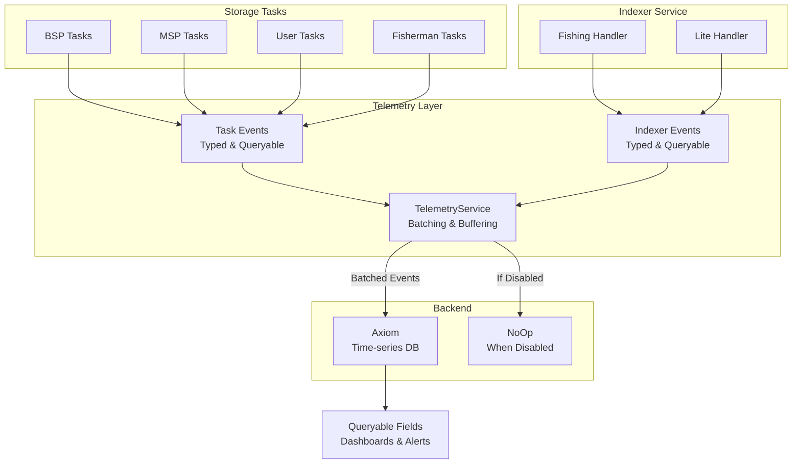
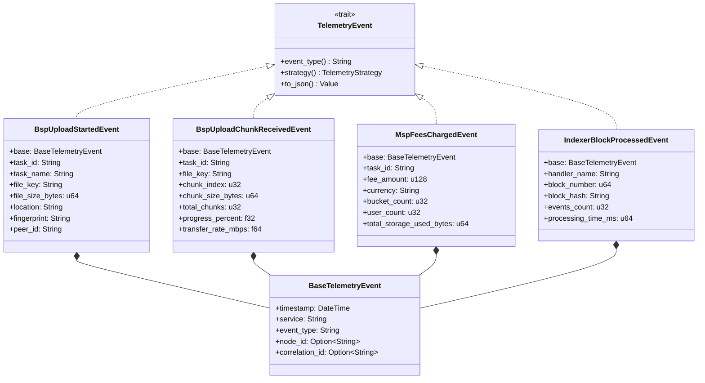
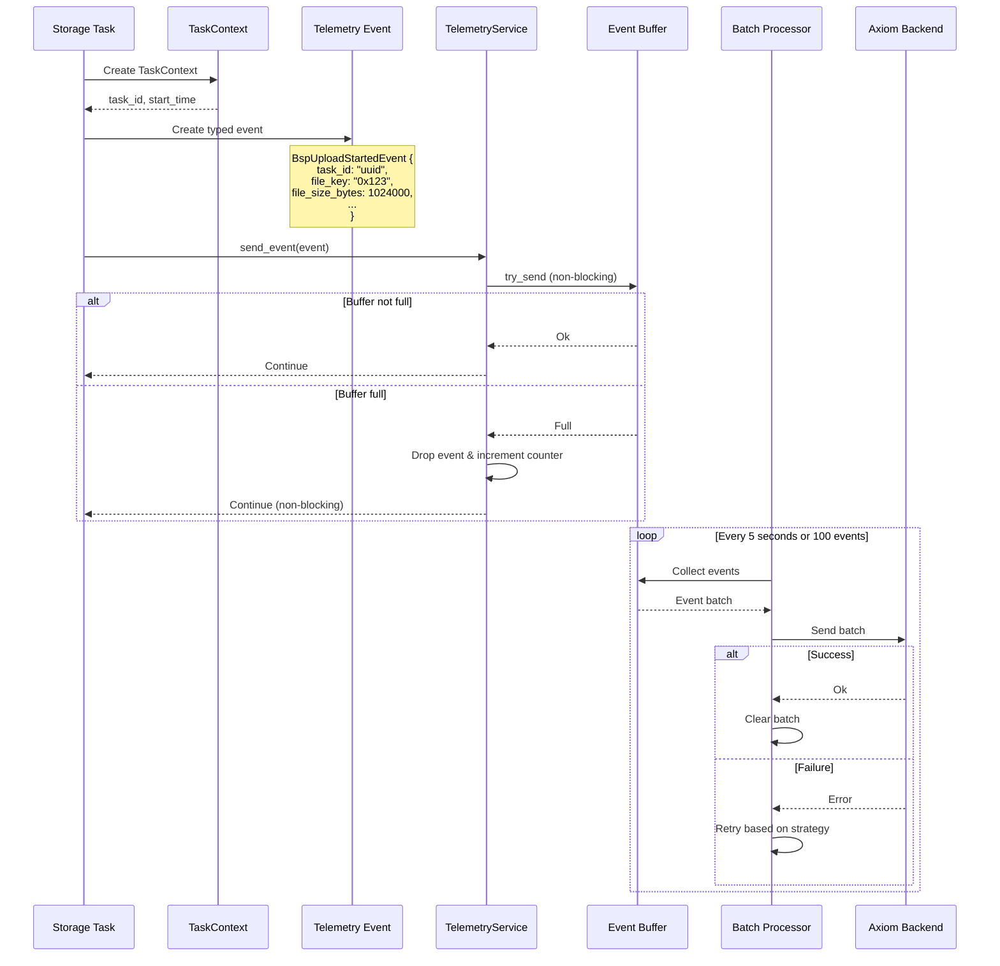
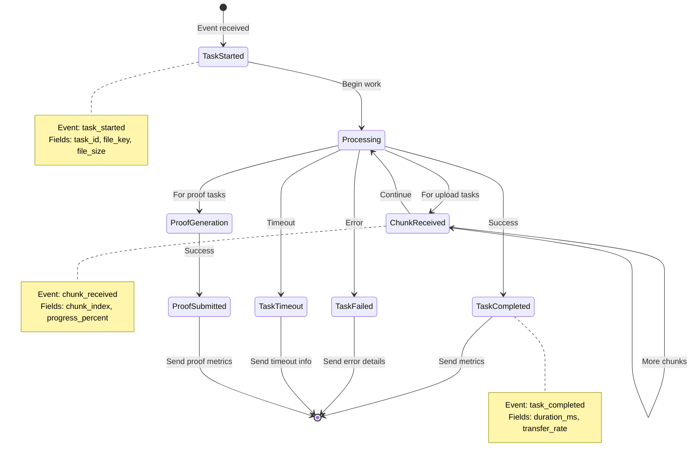
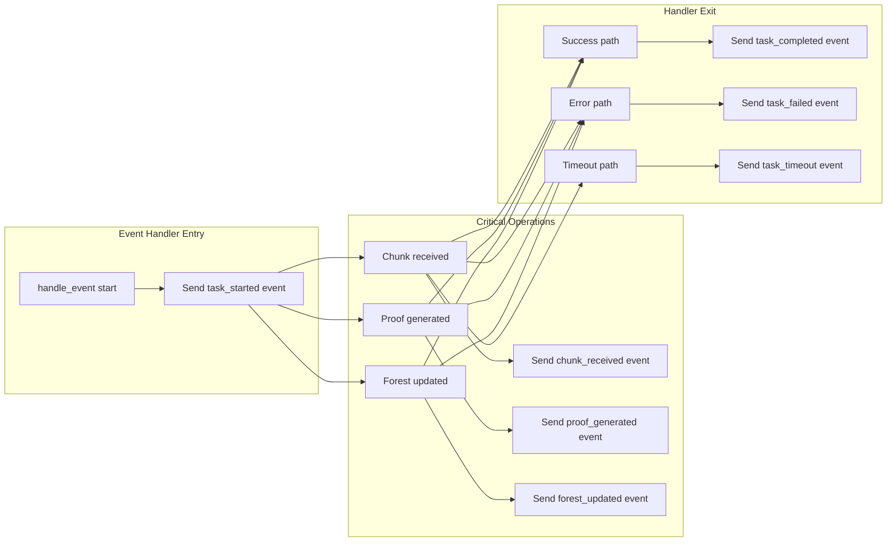
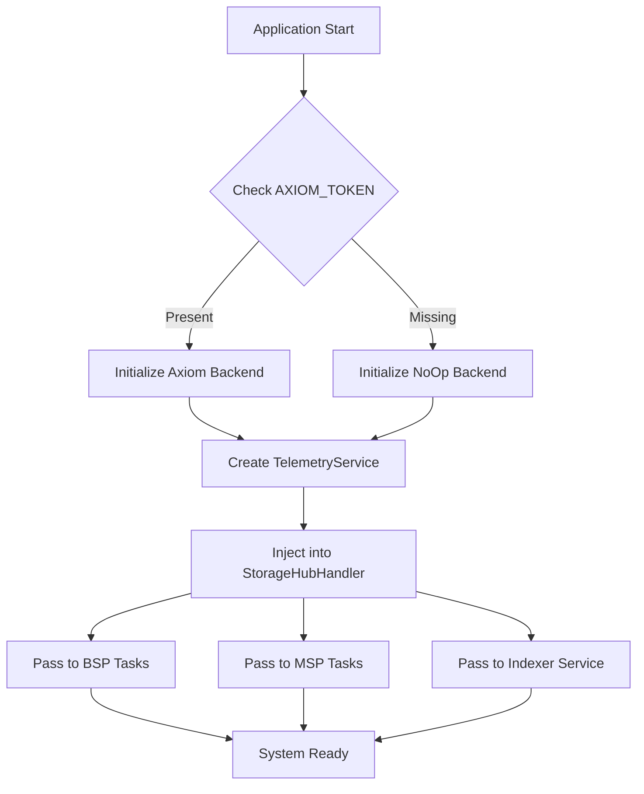

# StorageHub Telemetry Integration Plan

## Overview
This document provides a comprehensive plan for integrating telemetry throughout the StorageHub client system. The telemetry system provides production-ready observability with fully queryable, typed fields for all storage operations.

## Core Architecture

### Data Flow Overview



### Event Type Hierarchy



## Implementation Architecture

### Component Integration Flow



### Task Lifecycle Telemetry



## Event Type Definitions

### Key Principle: Queryable Fields Only
**Every field must be a top-level, typed field. No JSON blobs for metrics.**

### BSP Event Types

#### File Upload Events
```rust
// Event sent when BSP starts receiving a file
pub struct BspUploadStartedEvent {
    #[serde(flatten)]
    pub base: BaseTelemetryEvent,      // Common fields
    
    // Task identification
    pub task_id: String,                // Unique task instance ID
    pub task_name: String,              // "bsp_upload_file"
    
    // File metadata (all queryable)
    pub file_key: String,               // Hex-encoded file key
    pub file_size_bytes: u64,          // Total file size
    pub location: String,               // Storage location
    pub fingerprint: String,            // File fingerprint
    pub peer_id: String,                // Peer sending the file
}

// Event sent for each chunk received
pub struct BspUploadChunkReceivedEvent {
    #[serde(flatten)]
    pub base: BaseTelemetryEvent,
    
    pub task_id: String,                // Links to BspUploadStartedEvent
    pub file_key: String,               
    pub chunk_index: u32,               // Current chunk number
    pub chunk_size_bytes: u64,          // Size of this chunk
    pub total_chunks: u32,              // Total expected chunks
    pub chunks_received: u32,           // Chunks received so far
    pub progress_percent: f32,          // Upload progress (0-100)
    pub transfer_rate_mbps: f64,        // Current transfer rate
}

// Event sent when upload completes successfully
pub struct BspUploadCompletedEvent {
    #[serde(flatten)]
    pub base: BaseTelemetryEvent,
    
    pub task_id: String,
    pub task_name: String,
    pub file_key: String,
    pub file_size_bytes: u64,
    pub duration_ms: u64,               // Total upload time
    pub average_transfer_rate_mbps: f64,
    pub proof_generation_time_ms: u64,  // Time to generate proof
    pub forest_root: String,            // New forest root
    pub merkle_root: String,            // File merkle root
}
```

#### Proof Submission Events
```rust
pub struct BspProofGenerationStartedEvent {
    #[serde(flatten)]
    pub base: BaseTelemetryEvent,
    
    pub task_id: String,
    pub proof_type: String,             // "storage" or "challenge"
    pub challenges_count: u32,          // Number of challenges
    pub forest_root: String,            // Current forest root
}

pub struct BspProofSubmittedEvent {
    #[serde(flatten)]
    pub base: BaseTelemetryEvent,
    
    pub task_id: String,
    pub proof_type: String,
    pub challenges_answered: u32,       // Challenges successfully answered
    pub merkle_root: String,            
    pub forest_root: String,
    pub generation_time_ms: u64,        // Proof generation time
    pub submission_attempts: u32,       // Number of submission attempts
    pub extrinsic_hash: String,        // Blockchain transaction hash
}
```

### MSP Event Types

#### Storage Management Events
```rust
pub struct MspUploadAcceptedEvent {
    #[serde(flatten)]
    pub base: BaseTelemetryEvent,
    
    pub task_id: String,
    pub file_key: String,
    pub bucket_id: String,              // Bucket storing the file
    pub file_size_bytes: u64,
    pub capacity_used_bytes: u64,       // Current capacity used
    pub capacity_available_bytes: u64,  // Remaining capacity
    pub auto_capacity_increased: bool,  // Was capacity auto-increased?
    pub capacity_increase_amount: Option<u64>,
}

pub struct MspFeesChargedEvent {
    #[serde(flatten)]
    pub base: BaseTelemetryEvent,
    
    pub task_id: String,
    pub fee_amount: u128,               // Amount charged
    pub currency: String,               // "DOT"
    pub bucket_count: u32,              // Number of buckets
    pub user_count: u32,                // Number of users charged
    pub total_storage_used_bytes: u64,  // Total storage being charged for
    pub billing_period: String,         // "monthly", "weekly", etc.
    pub successful_charges: u32,        // Successful fee collections
    pub failed_charges: u32,            // Failed fee collections
}
```

### Indexer Event Types

```rust
pub struct IndexerBlockProcessedEvent {
    #[serde(flatten)]
    pub base: BaseTelemetryEvent,
    
    pub handler_name: String,           // "fishing" or "lite"
    pub block_number: u64,
    pub block_hash: String,
    pub parent_hash: String,
    pub events_count: u32,              // Events in this block
    pub processing_time_ms: u64,
    pub indexing_mode: String,          // Current indexing mode
}

pub struct IndexerEventProcessedEvent {
    #[serde(flatten)]
    pub base: BaseTelemetryEvent,
    
    pub handler_name: String,
    pub block_number: u64,
    pub event_name: String,             // "FileSystem.NewStorageRequest"
    pub event_index: u32,               // Index within block
    pub processing_time_ms: u64,
    
    // Event-specific fields (all Optional, filled based on event type)
    pub file_key: Option<String>,
    pub bucket_id: Option<String>,
    pub provider_id: Option<String>,
    pub user_id: Option<String>,
}
```

## Integration Points

### Where to Add Telemetry



### Implementation Pattern

```rust
// PATTERN: Task Event Handler with Full Telemetry
impl<NT, Runtime> EventHandler<NewStorageRequest> for BspUploadFileTask<NT, Runtime> {
    async fn handle_event(&mut self, event: NewStorageRequest) -> anyhow::Result<()> {
        // 1. Create task context for tracking
        let ctx = TaskContext::new("bsp_upload_file");
        
        // 2. Send task started event
        if let Some(telemetry) = &self.telemetry {
            let start_event = BspUploadStartedEvent {
                base: telemetry.create_base_event("bsp_upload_started"),
                task_id: ctx.task_id.clone(),
                task_name: ctx.task_name.clone(),
                file_key: format!("{:?}", event.file_key),
                file_size_bytes: event.file_size,
                location: hex::encode(&event.location),
                fingerprint: format!("{:?}", event.fingerprint),
                peer_id: event.peer_id.to_string(),
            };
            telemetry.send_event(start_event);
        }
        
        // 3. Execute task with error handling
        match self.process_storage_request(event, &ctx).await {
            Ok(result) => {
                // 4. Send success event with metrics
                if let Some(telemetry) = &self.telemetry {
                    let complete_event = BspUploadCompletedEvent {
                        base: telemetry.create_base_event("bsp_upload_completed"),
                        task_id: ctx.task_id,
                        task_name: ctx.task_name,
                        file_key: format!("{:?}", event.file_key),
                        file_size_bytes: event.file_size,
                        duration_ms: ctx.elapsed_ms(),
                        average_transfer_rate_mbps: result.transfer_rate,
                        proof_generation_time_ms: result.proof_time,
                        forest_root: format!("{:?}", result.forest_root),
                        merkle_root: format!("{:?}", result.merkle_root),
                    };
                    telemetry.send_event(complete_event);
                }
                Ok(())
            }
            Err(e) => {
                // 5. Send failure event with error details
                if let Some(telemetry) = &self.telemetry {
                    let failed_event = BspUploadFailedEvent {
                        base: telemetry.create_base_event("bsp_upload_failed"),
                        task_id: ctx.task_id,
                        task_name: ctx.task_name,
                        file_key: format!("{:?}", event.file_key),
                        duration_ms: ctx.elapsed_ms(),
                        error_type: classify_error(&e),
                        error_message: e.to_string(),
                        retry_count: self.retry_count,
                        chunks_received: self.chunks_received,
                        total_chunks: self.total_chunks,
                    };
                    telemetry.send_event(failed_event);
                }
                Err(e)
            }
        }
    }
}
```

## Query Examples

### Axiom Query Language (KQL)

#### Find Slow Uploads
```kusto
// Find uploads taking longer than 10 seconds
['storage-hub-prod']
| where event_type == "bsp_upload_completed"
| where duration_ms > 10000
| project task_id, file_key, file_size_bytes, duration_ms, average_transfer_rate_mbps
| order by duration_ms desc
| take 100
```

#### Track Upload Progress Real-time
```kusto
// Monitor ongoing upload progress for a specific file
['storage-hub-prod']
| where file_key == "0x123abc..."
| where event_type in ("bsp_upload_started", "bsp_upload_chunk_received", "bsp_upload_completed", "bsp_upload_failed")
| project timestamp, event_type, progress_percent, chunks_received, total_chunks, transfer_rate_mbps
| order by timestamp asc
```

#### Proof Generation Performance
```kusto
// Analyze proof generation performance over time
['storage-hub-prod']
| where event_type == "bsp_proof_submitted"
| summarize 
    avg_generation_time = avg(generation_time_ms),
    p95_generation_time = percentile(generation_time_ms, 95),
    p99_generation_time = percentile(generation_time_ms, 99),
    total_proofs = count(),
    failed_attempts = sum(submission_attempts - 1)
    by bin(timestamp, 1h), proof_type
| render timechart
```

#### Error Analysis
```kusto
// Categorize and count errors by type
['storage-hub-prod']
| where event_type contains "failed"
| summarize 
    error_count = count(),
    unique_tasks = dcount(task_id),
    avg_retry_count = avg(retry_count)
    by error_type, task_name, bin(timestamp, 1h)
| order by error_count desc
```

#### MSP Capacity Monitoring
```kusto
// Monitor MSP capacity utilization
['storage-hub-prod']
| where event_type == "msp_upload_accepted"
| extend utilization_percent = (capacity_used_bytes * 100.0) / (capacity_used_bytes + capacity_available_bytes)
| project timestamp, bucket_id, utilization_percent, auto_capacity_increased
| where utilization_percent > 80
| order by utilization_percent desc
```

#### Fee Collection Metrics
```kusto
// Track fee collection success rate
['storage-hub-prod']
| where event_type == "msp_fees_charged"
| extend success_rate = (successful_charges * 100.0) / (successful_charges + failed_charges)
| summarize 
    total_fees = sum(fee_amount),
    avg_success_rate = avg(success_rate),
    total_users = sum(user_count)
    by billing_period, bin(timestamp, 1d)
| render columnchart
```

## Configuration

### Environment Variables

```bash
# REQUIRED: Axiom Configuration
AXIOM_TOKEN=xaat-your-token-here       # Axiom API token
AXIOM_DATASET=storage-hub-prod         # Dataset name in Axiom

# OPTIONAL: Telemetry Tuning
TELEMETRY_BUFFER_SIZE=10000           # Max events in buffer (default: 10000)
TELEMETRY_BATCH_SIZE=100              # Events per batch (default: 100)
TELEMETRY_FLUSH_INTERVAL=5            # Seconds between flushes (default: 5)
TELEMETRY_BACKEND_TIMEOUT=10          # Backend timeout seconds (default: 10)
TELEMETRY_MAX_RETRIES=3               # Retry attempts (default: 3)
```

### Initialization Flow



## Testing Strategy

### Unit Test Requirements
```rust
#[cfg(test)]
mod tests {
    // 1. Test event creation
    #[test]
    fn test_event_serialization() {
        let event = BspUploadStartedEvent { /* ... */ };
        let json = serde_json::to_value(&event).unwrap();
        
        // Verify all fields are top-level
        assert!(json["file_key"].is_string());
        assert!(json["file_size_bytes"].is_u64());
        // No nested objects for metrics
        assert!(json["custom_metrics"].is_null());
    }
    
    // 2. Test non-blocking behavior
    #[tokio::test]
    async fn test_telemetry_non_blocking() {
        let telemetry = create_test_telemetry();
        
        // Fill buffer
        for _ in 0..20000 {
            telemetry.send_event(test_event());
        }
        
        // Should not block, should drop events
        let start = Instant::now();
        telemetry.send_event(test_event());
        assert!(start.elapsed() < Duration::from_millis(1));
    }
}
```

## Success Criteria

### Technical Requirements
- ✅ All fields are queryable (no JSON blobs)
- ✅ Zero blocking on telemetry operations
- ✅ < 1% performance overhead
- ✅ 100% task coverage
- ✅ Graceful degradation when disabled

### Observable Metrics
- File transfer success/failure rates
- Average transfer speeds by provider
- Proof generation p50/p95/p99 times
- Storage capacity utilization trends
- Fee collection success rates
- Error rates by task and type
- Provider performance rankings

## Migration Checklist

### Phase 1: Foundation (Week 1)
- [ ] Create event type definitions for all tasks
- [ ] Add telemetry field to StorageHubHandler
- [ ] Update builder pattern to inject telemetry
- [ ] Create TaskContext helper

### Phase 2: Critical Path (Week 2)
- [ ] Instrument BSP upload flow
- [ ] Instrument MSP upload flow
- [ ] Instrument proof generation
- [ ] Add chunk-level progress tracking

### Phase 3: Complete Coverage (Week 3)
- [ ] Instrument remaining BSP tasks
- [ ] Instrument remaining MSP tasks
- [ ] Instrument user and fisherman tasks
- [ ] Add indexer telemetry

### Phase 4: Operations (Week 4)
- [ ] Configure Axiom dashboards
- [ ] Set up alerts
- [ ] Create runbooks
- [ ] Performance testing

## Summary

This telemetry system provides:

1. **Full Queryability**: Every field is a typed, top-level field that can be queried, aggregated, and visualized
2. **Clean Abstraction**: Generic telemetry infrastructure with service-specific event types
3. **Type Safety**: Compile-time validation of all events and fields
4. **Non-blocking**: Never impacts task performance
5. **Production Ready**: Batching, buffering, retry logic, and graceful shutdown

The key architectural decision is to use **typed, service-specific events** rather than generic events with JSON blobs. This ensures all data is queryable while maintaining clean separation between the generic telemetry infrastructure and service-specific metrics.