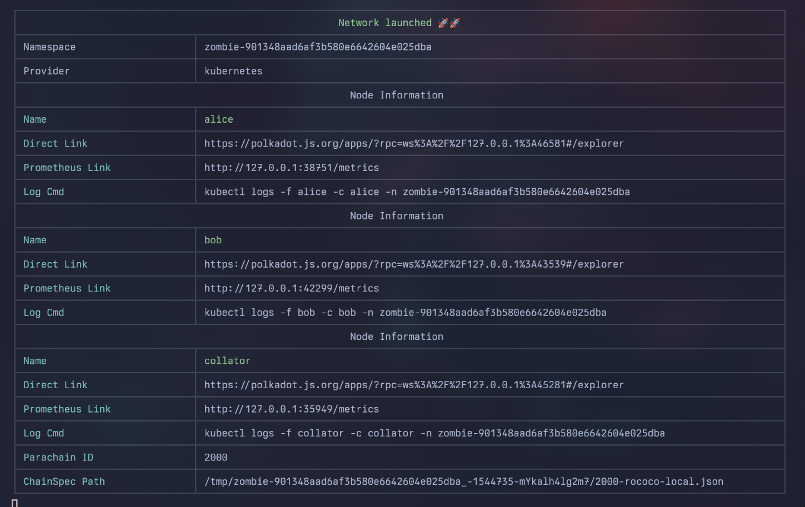

# StorageHub Testing

## Pre-requisites

### pnpm

[pnpm](https://pnpm.io/) is used in this project as the Javascript package manager to install dependencies. To install it you can follow the official instructions at: [https://pnpm.io/installation](https://pnpm.io/installation)

The quickest way is via their script: `curl -fsSL https://get.pnpm.io/install.sh | sh -`

## Docker Setup

> [!IMPORTANT]
> This is required for `DEV` & `BSPNET` modes.

#### 1. Build Node

##### Linux

```sh
cargo build --release
```

##### MacOS

> [!IMPORTANT]
> If you are running this on a Mac, `zig` is a pre-requisite for crossbuilding the node. Instructions to install can be found [here](https://ziglang.org/learn/getting-started/).

```sh
pnpm crossbuild:mac
```

#### 2. Build Docker Image

```sh
pnpm docker:build
```

## Testing Types

### BSPNet

This is a small network running in `dev` mode, with manual sealing on blocks, between a BSP & a User node. This is used to test the merklisation of files, and their retrieval.

```sh
pnpm test:bspnet
```

### Dev Node Test

The `storage-hub` node is run in a docker container in dev mode, so that it can be isolated and parallelized across multiple threads & runners. The purpose of this suite is verify functionality of both the RPC and runtime.

> [!IMPORTANT]
> Provider functionality is not covered here, only how the system chain behaves.

```sh
pnpm test:node
```

### End-To-End Tests

> [!NOTE]
> Please ensure the rust project is built first e.g. `cargo build --release`.
> This is required as currently we only support native binaries.

In `/test` run: `pnpm install` to install zombienet

#### 1. Run Network

```shell
# in the /test directory
pnpm i
pnpm zombie:run:full:native
```

Wait for zombie network to start, and then:

#### 2. Run Setup & Tests

```shell
pnpm update-types
pnpm zombie:setup:native
pnpm zombie:test suites/zombie
```

### ZombieNet

This is the networking testing suite for topology and network stability. It is a suite of tests that run on a network of nodes, and is used to verify the network's stability and the nodes' ability to communicate with each other.

```sh
pnpm zombie:test:native
```

## Launching Networks

### Spawning Local DevNode

- Native launch: `../target/release/storage-hub --dev`
- Docker launch (local): `pnpm docker:start` / `pnpm docker:stop`
- Docker launch (latest): `pnpm docker:start:latest` / `pnpm docker:stop:latest`

### Spawning ZombieNet Native

> [!TIP]
> Polkadot binaries are required to run a zombienet network.
> For Linux you can run the script: `pnpm tsx scripts/downloadPolkadot.ts <version>`
> For macOS you will have to [compile from source](https://github.com/paritytech/polkadot-sdk/tree/master/polkadot#build-from-source).

To launch a non-ephemeral ZombieNetwork by executing the following in: `/test` directory:

```sh
pnpm install
pnpm zombie:run:native
```

From here you should see in the terminal, the different nodes being spun up. When the network is fully launched, you should see something like this:



From here you can interact via the websockets exposed in the direct links, in the example above we have:

- Alice (relay): `35005`
- Bob (relay): `37613`
- Collator (storage-hub): `45615`

## Generating new Type Interfaces

This repo uses Parity's [polkadot-api](https://github.com/polkadot-api/polkadot-api) AKA PAPI.
To generate new type interfaces run the following in `/test`:

```sh
pnpm update-types
```

## Misc

### Why do we use Docker so much?


